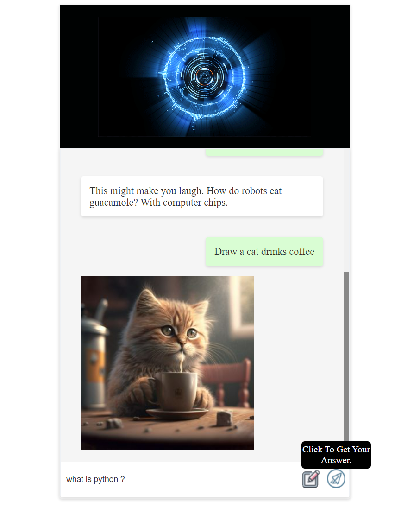
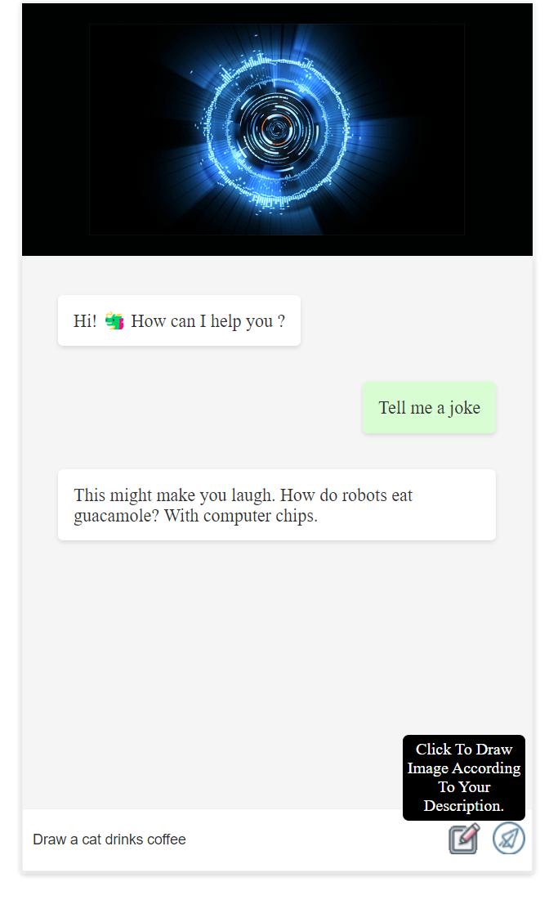
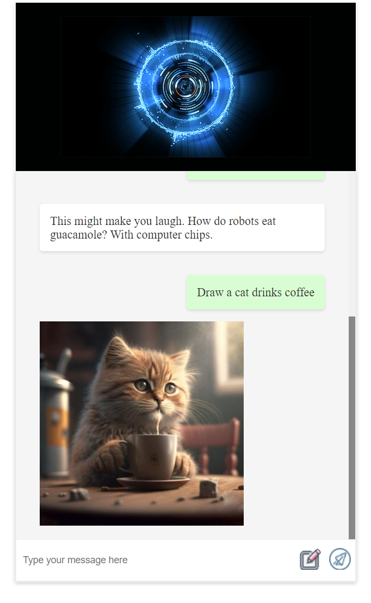

# F.R.I.D.A.Y

F.R.I.D.A.Y is An AI writing/drawing assistant that helps to answer questions and generating images according to user description.

## Screenshots

# Table Of Content

- [Installation](#installation)
- [WIP Plan](#wip-plan)
    
## Installation
* Download the project
* Download Python 3.7 or higher
* Install the requirements using `pip install -r requirements.txt`
* Run the project using `python start.py`

## WIP Plan
- [x] Answering Questions
- [x] Generating Images
- [ ] Generating subtitles
- [ ] Summarizing youtube videos

